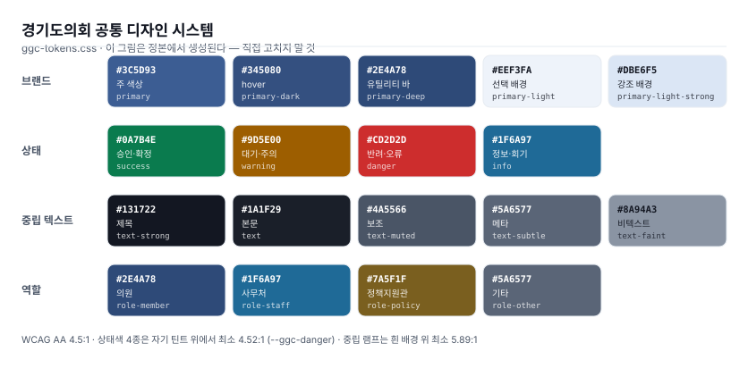

# 경기도의회 공통 디자인 시스템

경기도의회 의정정보시스템 전 서비스가 공유하는 **디자인 토큰 · 컴포넌트 · 브랜드 자산 ·
검사기**다. 11개 프런트엔드(Next 14/15/16 · React 18/19 · Vite · JSP/Tiles · Jinja2 ·
FastAPI · 정적 HTML)가 이 한 벌을 소비한다.



> 위 그림은 **정본에서 생성된 것**이다(`design/examples/build-preview.py`).
> 값을 옮겨 적지 않았고, 토큰이 바뀌면 다시 생성해야 하며,
> 낡으면 `check_design.py --canon` 이 잡는다.

## 먼저 눈으로 보기 — `design/examples/`

**저장소를 내려받아 [`design/examples/index.html`](design/examples/index.html) 을
브라우저로 열면 된다.** 서버도 빌드도 패키지 설치도 필요 없다.
(GitHub 웹에서는 HTML 이 렌더되지 않고 소스로만 보인다.)

| 페이지 | 무엇을 보나 |
|---|---|
| [`index.html`](design/examples/index.html) | 개요 · 3분 도입 · 관통 원칙 · 접근성 |
| [`tokens.html`](design/examples/tokens.html) | 색 · 타이포 · 간격 · 형태 · 포커스 **전수**, 대비비 실측 |
| [`components.html`](design/examples/components.html) | 버튼 · 배지 · 카드 · 통계 · 행리스트 · 표 · 폼 · 위저드 · 빈상태 3종 |
| [`dashboard.html`](design/examples/dashboard.html) | Monitor archetype 이 실물 업무 화면으로 조립된 모습 |
| [`wizard.html`](design/examples/wizard.html) | Configure archetype — 스텝퍼 3형 · 폼 · 오류 상태 |

**파일 하나로 열고 싶으면** `design/examples/examples-standalone.html` 을 쓴다 —
5쪽과 정본 CSS·JS·의회 마크를 한 파일에 인라인한 **생성물**(약 195KB)이고
**외부 요청이 0** 이라 망분리 환경과 오프라인에서도 그대로 뜬다. 링크로 공유할 때 쓴다.
손으로 고치지 말 것 — `build-standalone.py` 가 정본에서 다시 만든다.

갤러리는 **정본을 상대경로로 직접 링크한다.** 사본을 두지 않으므로 정본의
스모크 테스트이기도 하다 — 실제로 이걸 만들면서 정본 결함 두 개를 찾았다
(`.ggc-gnb-brand` 가 링크일 때의 밑줄, `.ggc-wizard-mini` 의 가로 오버플로).
자세한 규칙은 [`design/examples/README.md`](design/examples/README.md).

## 관통 원칙 — 이름은 복제해도 되고, 값은 복제하면 안 된다

이 조직에서 값 복제는 **이미 실패한 실험**이다. 계약 문서가 선언한 `success` 값이
실물 CSS 와 두 달간 어긋난 채 아무도 그 갭을 보지 않았다.

- **토큰 이름**(`--ggc-primary`)은 소비자와의 인터페이스 → 문서가 색인해도 안전
- **값**(`#3c5d93`)은 구현 → **`design/ggc-tokens.css` 한 곳에만** 산다

값이 필요하면 그 파일을 연다. 문서에 값을 적는 순간 그 줄은 낡기 시작한다.

## 빠른 시작

```bash
# 1. 토큰을 복사한다. 손으로 옮겨 적지 않는다 — 바이트 동일이어야 검사가 성립한다
cp design/ggc-tokens.css <서비스>/<정적루트>/ggc-tokens.css

# 2. 자기 스타일보다 먼저 로드한다. 순서가 곧 우선순위다
#    <link rel="stylesheet" href="ggc-tokens.css">
#    <link rel="stylesheet" href="app.css">

# 3. 브랜드 자산을 복사한다 (대상 경로는 design/brand/ASSET-MAP.tsv 가 고정)
cp design/brand/dist/favicon-32.png <서비스>/<정적루트>/

# 4. 검사한다
python design/check_design.py --report <서비스경로>
```

**패키지가 아니라 복사다.** 프런트가 7종이라 CSS 커스텀 프로퍼티가 최소공배수이고,
npm 워크스페이스·사설 레지스트리가 0건이다. React 컴포넌트는 공유하지 않는다.

## 무엇이 들어 있나

| 경로 | 무엇 |
|---|---|
| `design/ggc-tokens.css` | **토큰 정본 v1.2** — 색·타이포·간격·형태·포커스·셸 치수 |
| `design/ggc-components.css` | 컴포넌트 v1.1 — 셸(GNB/LNB)·카드·버튼·표·폼·위저드·반응형 |
| `design/ggc-fonts.css` + `design/fonts/` | **폰트 정본 v1.0** — @font-face 하나와 가변 woff2 하나. 두 파일을 같은 폴더에 나란히 두고 토큰보다 먼저 링크한다 |
| `design/check_design.py` | **검사기** — `diff -q` 를 대체하는 6종 검사 |
| `design/brand/` | 파비콘 세트 · 의회 마크 · stdlib 전용 생성기 · 배포 매핑표 |
| **`design/examples/`** | **예제 갤러리 5쪽** — 빌드 없이 열리는 실물. 여기부터 보면 된다 |
| `skills/2ggc-design/` | **디자인 가이드 본문** — 화면 처방·스택별 착지점·리스킨·검증 |
| `docs/23-…-단일디자인-계약.md` | 상위 계약 (AUTHORITATIVE) |
| `docs/krds-alignment.md` | **KRDS 정렬** — 무엇을 따르고 무엇을 오버라이드하는가 |

## 가이드 읽는 순서

0. **[design/examples/index.html](design/examples/index.html)** — 먼저 눈으로 본다.
   글로 읽기 전에 무엇이 나오는지 알면 나머지가 훨씬 빨리 읽힌다
1. **[skills/ggc-design/SKILL.md](skills/ggc-design/SKILL.md)** — 전체 절차
2. [references/contract.md](skills/ggc-design/references/contract.md) — 바꾸면 안 되는 것
3. [references/archetypes.md](skills/ggc-design/references/archetypes.md) — 화면을 무엇으로 어떤 순서로
4. [references/porting.md](skills/ggc-design/references/porting.md) — 스택별 착지점과 함정
5. [references/brand-assets.md](skills/ggc-design/references/brand-assets.md) — 파비콘·마크
6. [references/reskin.md](skills/ggc-design/references/reskin.md) — 가동 중 서비스 수렴
7. [references/verify.md](skills/ggc-design/references/verify.md) — 검증과 복귀 지점

## 검사기

```bash
python design/check_design.py --canon                 # 정본 자체 (문서↔파일 갭)
python design/check_design.py --report <서비스경로>    # 판정만
python design/check_design.py --gate   <서비스경로>    # FAIL 이면 exit 1
python design/check_design.py --all    <서비스루트>    # 전수 요약
```

| ID | 검사 | 왜 필요했나 |
|---|---|---|
| D1 | 토큰 사본 바이트 동일 | |
| **D2** | 색 리터럴이 허용집합 안인가 | `diff -q` 는 **값을 인라인 이식한 서비스를 원리상 판정 못 한다** |
| D3 | 로드 순서 · 공통 셸 · 파비콘 | 순서 역전은 "왜 색이 안 먹지" 로만 나타난다 |
| D4 | 외부 폰트 CDN 0 | 망분리에서 깨진다 |
| D5 | `:focus-visible` · 대체 없는 `outline:none` · 대비 | |
| D6 | **정본 자체** — 계약 문서 ↔ 토큰 ↔ 컴포넌트 ↔ 생성물 | 갭이 두 달간 안 보였다 |

검사기는 **설명을 위반으로 세지 않는다.** 주석과 HTML `<code>`/`<pre>` 본문은 스캔에서
제외한다 — 그러지 않으면 “`#256ef4` 는 폐기값” 이라고 적는 순간 그 문장이 FAIL 이 되어
**규칙을 문서화할수록 FAIL 이 늘어난다.** D5 의 포커스 검사는 `<link>` 로 부르는
로컬 CSS 까지 따라간다(사본 무결성은 D1 이 따로 본다).

허용집합은 **매 실행 시 정본 CSS 에서 파생**한다. 락파일을 만들지 않는다 —
락파일은 "정본과 같아야 하는 파일" 을 하나 더 만드는 것이고, 그게 지금 문제의 형태다.

예외는 코드 옆에서 사유와 함께 등록한다:

```css
/* ggc-design-allow: #13778e — 표창관리 이관 브랜드. 리스킨 대기 */
```

## 접근성

토큰 v1.2 는 **WCAG AA(4.5:1)** 를 통과한다. v1.1 은 자기 자신이 미달이었고
(상태색 4종이 자기 틴트 위에서 3.65~3.83:1, 배지 7종 전부), 경기도의회는 공공기관이라
KWCAG 2.2 가 법적 준수 대상이다.

값과 무관하게 지키는 것 — **색 단독 의존 금지**(배지에 텍스트·아이콘 병기) ·
`--ggc-text-faint` 를 텍스트에 쓰지 않기 · 링크에 밑줄 · `:focus-visible` 가시 링 필수 ·
placeholder 를 유일한 라벨로 쓰지 않기.

**고대비**는 토큰이 처리한다 — 서비스가 따로 만들 것이 없다.

- `forced-colors: active` (**Windows 고대비 테마**) — OS 가 색을 갈아끼우므로 팔레트를
  정의하는 게 아니라 **깨지지 않게** 한다. ⚠ 이 모드에서 `box-shadow` 는 렌더되지 않아
  **포커스 링이 통째로 사라지고 있었다**(WCAG 2.4.7). `outline` 으로 복원했고,
  배경색만으로 구분되던 배지·활성 내비·합계행에 테두리를 보장했다.
- `prefers-contrast: more` — 색 반전 없이 중립을 한 단계 진하게, 링을 두껍게.

**새 토큰 이름도 두 번째 팔레트도 만들지 않았다.** KRDS 의 `mode-high-contrast` 는
밝은 글자를 쓰는 사실상 다크 테마라 따르지 않았다 — 계약이 비범위로 둔 다크모드를
우회 도입하게 되고 토큰 표면이 2배가 된다. 근거는
[docs/krds-alignment.md §7](docs/krds-alignment.md).

## 정부 표준(KRDS)과의 관계

**기반이지만 그대로 채택하지는 않는다.** 브랜드 색은 기관 CI 로 오버라이드하고
(KRDS 가 전제하는 사용법이다), 간격 스케일은 KRDS 부분집합으로 일치하며,
상태색·중립 램프·컨트롤 높이는 갈린다.

상태색은 **KRDS 로 수렴하지 않기로 결정했다**(2026-08-22). CIELAB 색차로 확인하니
v1.2 가 AA 를 통과하는 값 중 **디자인 원본에 가장 가까운 집합**이고(ΔE 5.7~10.1,
색상각 Δ0~2°), KRDS 값은 대비가 0.5~0.7 좋아지는 대신 경기도의회 CI 톤에서 멀어진다.
**기관 CI 유지가 우선**이다.

전부 실측 대조해 [docs/krds-alignment.md](docs/krds-alignment.md) 에 적었다.
**정부 표준 완전 준수를 주장하지 않는다.**

## 이 저장소의 지위

**정본은 상위 플랫폼 저장소(`ggc_ai_platform`)의 `design/` 과
`plugins/ggc-deploy/skills/2ggc-design/` 이다.** 여기는 **공유용 배포판**이다 —
서비스 소스와 배포 파이프라인이 그쪽에 있어 작업이 거기서 일어난다.

**Claude Design 의 「경기도의회 공통 디자인 시스템」 프로젝트도 정본이 아니다.**
그쪽은 시안·프로토타입을 만들기 위한 **파생판**이고, 값이 갈리면 이 저장소(정확히는
상위 플랫폼 저장소)가 이긴다. 그쪽에서 새로 만들어진 것이 생기면 **로컬 정본으로
역수입한 뒤** 여기로 내려온다 — 반대 방향으로 흐르지 않는다. 검사기와 배포 파이프라인이
전부 로컬 경로를 보고, 망분리된 서버는 claude.ai 에 접근하지 못하기 때문이다.

이 프로젝트는 네트워크 구성도에서 이미 같은 모델을 쓴다(정본 하나 + 공유용 생성물).
두 벌이 갈라지지 않게 `tools/sync-from-platform.sh` 가 복사와 드리프트 검출을 한다.

```bash
bash tools/sync-from-platform.sh          # 정본에서 복사
bash tools/sync-from-platform.sh --check  # 갈라졌는지만 확인 (복사 안 함)
```

## 공개 전환 전 확인할 것

지금은 **private** 이다. public 으로 돌리면 되돌릴 수 없으므로(색인·포크) 아래를 먼저 본다.

이미 되어 있는 것 —
- 인프라 주소는 **마스킹**돼 있다. `27.96.x.x` 처럼 나오는 것이 그것이고,
  치환 목록은 상위 저장소의 `redaction-map.json` **shared 규약과 동일**하다.
  `tools/sync-from-platform.sh` 가 **복사할 때마다 다시 마스킹**하므로 되살아나지 않는다.
- `.gitignore` 가 `.env`·`*.pem`·`*.key`·`*-jwk.json`·`.mcp.json`·kubeconfig 를 막는다.
- 서비스 소스·k8s 매니페스트·DB 스키마는 **애초에 들어 있지 않다.** 상위 저장소에 있다.
- 예제 갤러리의 의안명·숫자·이름·날짜는 **전부 가상**이다. 위원회 이름만 실제 상임위
  명칭(공개 정보)이고, 사람 이름은 `이○○` 처럼 마스킹된 형태만 쓴다.
- 개인키·API 키·토큰·JWT·비밀번호 대입: **현재 트리와 전체 이력 모두 0건**(2026-08-25 재확인).

⛔ **아직 남아 있는 것 — 이것이 해소되기 전에는 public 으로 돌리면 안 된다** —
- **과거 커밋에 공인 IP 원문이 살아 있다.** 마스킹은 2026-08-22 `3e0430b` 에서 적용됐고
  현재 트리는 깨끗하지만, 그 이전 커밋 `5f1e82f` 의 blob 4개에 원문이 그대로 있다:
  `skills/ggc-design/references/{verify,reskin,brand-assets}.md` · `design/brand/SOURCE.md`.
  **GitHub 은 public 전환 시 과거 커밋도 함께 열린다** — 트리에서 지워도 `git log` 에 남는다.
  해소하려면 이력을 다시 써야 한다(`git filter-repo` 로 치환 후 force push, 또는 orphan
  커밋 하나로 재시작). 미병합 원격 브랜치 `claude/uiux-improvement-methods-*` 도 같은
  이력을 공유하므로 함께 처리한다.
- 확인 명령 — 트리가 아니라 **이력**을 본다:
  ```bash
  git rev-list --all --objects | awk '{print $1}' | sort -u | while read o; do
    [ "$(git cat-file -t $o)" = blob ] && git cat-file -p $o | grep -aIn '<내부IP>'
  done
  ```

공개 전에 사람이 판단할 것 —
- **의회 마크의 대외 사용 범위.** 기관 CI 자산이다. 저장소가 공개되면 누구나 받아 쓴다.
- **`docs/23` 계약 문서**에 시스템 목록과 화면 구성이 들어 있다. 대외 공개가 맞는지.
- **가로조합 로고 3판·축약 로고·슬로건은 이 저장소에 아직 넣지 않았다.** 로컬 정본에
  편입하는 것과 별개로, 기관 CI 의 대외 배포 판단이 나기 전까지 공유용 판에서는 보류한다.
  특히 슬로건은 신영복 선생 캘리그래피 기반이라 마크와는 별개의 판단이 필요하다.

## 라이선스·자산

의회 마크(`design/brand/assembly-mark.png`)는 경기도의회 공식 홈페이지가 OG 이미지로
쓰는 파일이다. 출처와 파생 근거는 [design/brand/SOURCE.md](design/brand/SOURCE.md).

Pretendard GOV 1.3.9 가변은 **SIL Open Font License 1.1** 이며 원문을
[design/fonts/OFL.txt](design/fonts/OFL.txt) 에 함께 배포한다 — 재배포 시 이 파일을 유지한다.
예약 서체명("Pretendard")은 수정본에 쓸 수 없다.

자체 호스팅한다. **외부 CDN 을 링크하지 않는다** — 망분리 환경에서
요청이 나가지 않아 글꼴이 폴백으로 떨어진다.
