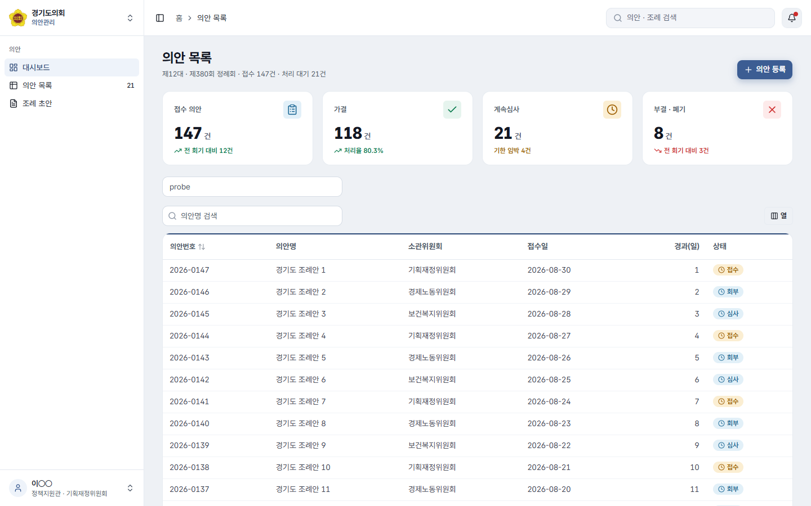

# v3.0 Tier 2 소비자 실증 (2026-09-05)

레지스트리 74항목이 **실제 소비 프로젝트에서 착지 · 빌드 · 렌더**되는지와, 계산 스타일이 토큰 값과 같은지를 쟀다.
절차는 `docs/quickstart/react-tier2.md` 그대로다. 실증 스크립트는 저장소 밖(스크래치)에서 돌렸고 여기에는 결과만 남긴다.

## 환경

| | |
|---|---|
| 레지스트리 서빙 | 저장소 루트 `python -m http.server 8765` → `http://127.0.0.1:8765/public/r/{name}.json` |
| 소비자 | `npx shadcn@4.19.0 init -t vite -b radix -p nova` (Vite 7 · React 19 · Tailwind v4 · shadcn 4.21 런타임) |
| 착지 | `npx shadcn add @ggc/ggc-style @ggc/ggc-shell @ggc/ggc-page-head @ggc/ggc-data-table @ggc/ggc-filter-bar @ggc/ggc-stat @ggc/ggc-search -y -o` |
| 손으로 | 토큰 `@import` 첫 줄 · `shadcn/tailwind.css` · `tw-animate-css` · `.dark` 삭제 · 폰트 2파일 복사 |
| 검증 | `tsc -b` · `vite build` · 헤드리스 Chrome(playwright-core) 1440×900 계산 스타일 |

## 결과

- 레지스트리 소스 전체(UI 45 · 블록 27 · 훅 1)를 참조 Vite 앱에 넣고 `tsc --noEmit` — **오류 0**.
- 소비자 `tsc -b` 통과 · `vite build` 통과(JS 450 KB · CSS 107 KB, gzip 138 / 18 KB) · **브라우저 콘솔 오류 0** · 가로 오버플로 0.

| 측정 | 업무 (기본) | 대민 (`data-ggc-profile="public"`) | 기대(토큰) |
|---|---|---|---|
| `Button` 높이 · 글자 · 배경 · radius | 36px · 14px · rgb(60,93,147) · 10px | 48px · 17px | `--ggc-control-h` · `--ggc-control-font` · `--ggc-primary` · `--ggc-radius` ✓ |
| `Input` 높이 · 글자 | 36px · 14px | 48px · 17px | `--ggc-input-h` ✓ |
| `PageHead` h1 크기 · 굵기 | 24px · 700 | 32px | `--ggc-h1-size` ✓ |
| `TableCell` 패딩 · 글자 | 8px 12px · 14px | 12px 16px · 17px | `--ggc-cell-pad` · `--ggc-table-font` ✓ |
| 사이드바 폭 | 256px | — | `--ggc-lnb-w` ✓ |
| 표 첫 화면 행수(1440×900, KPI 4 + 검색 위) | 12행 | — | Explore 갤러리(표만)는 20행 |

## 잡힌 결함

- **`Tooltip` must be used within `TooltipProvider`** — shadcn 공식 `sidebar` 의 접힘 툴팁이 Provider 를 요구하는데 셸이 감싸지 않아 첫 렌더가 죽었다.
  `ggc-shell` 의 `Shell` 이 `TooltipProvider` 로 감싸도록 수정하고 재실증했다(위 표는 수정 후 값).
- 대민 토글 직후 잰 버튼 높이가 37.19px 로 나왔다 — 공식 버튼의 `transition-all` 이 진행 중인 값이었다. 800ms 뒤 재측정 48px. 측정 스크립트에 대기를 넣었다.
- `@tanstack/react-table` 을 버전 없이 설치하면 v9(다른 API)가 들어온다 — 레지스트리가 `^8.21.0` 을 박는다.

## 화면

사이드바(브랜드 스위처 · 아이콘 메뉴 · 건수 배지 · 사용자) + 헤더(토글 · 브레드크럼 · 검색 · 알림) + 본문(h1 24 · KPI 4 · 데이터 표).
